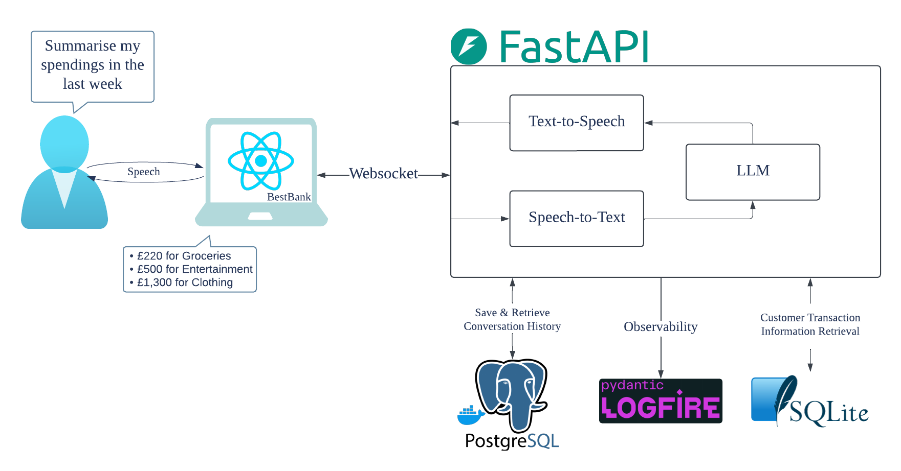

## Voice2Voice Bank Assistant

 

This is a backend + (sample) frontend Voice-to-Voice Banking Assistant project. 
With this application, users can communicate with their transaction records through an AI Agent. 

- Users connect to the backend via a websocket with FastAPI
- Groq API is used for Speech-to-Text conversion
- Text generation is done through a PydanticAI Agent 
- The Agent currently can perform the following functionalities:
    - Retrieve last n transactions based on optional filters for start date, end date, category, and merchant.
    - Providing a spendings summary for a given time period by category.
    - Identifying transactions that deviate from past behavior.
- Text-to-Speech is done through OpenAI's TTS models.
- The application uses a PostgreSQL database (running on Docker) to store and retrieve conversation history. 
- The user transaction database is a sqlite3 databse with sample transactions, from Kaggle.
- There is a UI with React that allows user communication with the server, and also shows chat history on the side. 
- Pydantic Logfire is used for real-time and historic observability of interactions with the server.

### Frontend

Shows the sample UI. On the side users can optionally see the conversation history.


### Observability

We can see real-time connections with logs, traces and calls.

Also we can setup a dashboard, alerts, and query the logs/traces database. 


### Project Structure

```shell
├── docker-compose.yaml # For conversation history db
├── Makefile # Used for ease of setup
├── env.sample
└── src/
    ├── backend/ # FastAPI backend
    │   ├── ai_services/
    │   │   ├── agent.py
    │   │   ├── factories.py
    │   │   ├── tools.py
    │   │   └── utils.py
    │   ├── api/ # Dependencies for the WebSocket and the FastAPI Lifespan
    │   │   ├── dependencies.py
    │   │   └── lifespan.py
    │   ├── config/ # Configuration settings and credentials
    │   │   └── settings.py
    │   ├── convo_history_db/ # Postgres db utils
    │   │   ├── actions.py
    │   │   └── connection.py
    │   ├── customer_transaction_db/ # Sqlite db utils
    │   │   ├── connection.py
    │   │   └── transactions.db
    │   ├── nlp_processor/
    │   │   ├── speech_to_text.py
    │   │   └── text_to_speech.py
    │   ├── pyproject.toml
    │   ├── server.py # Main FastAPI server
    │   ├── tests/
    └── frontend/ # React frontend
        ├── package.json
        ├── public/
        ├── README.md
        └── src/
            ├── App.css
            ├── App.tsx # Main app
            ├── components/ # Helper components
            │   ├── ChatContainer.tsx
            │   ├── Header.tsx
            │   ├── RecordingButtons.tsx
            │   └── Status.tsx
            ├── index.css
            ├── index.tsx
            ├── tests/
            └── welcome_llama.png
```

### Setup

- clone the repository
- run `make` in the terminal and follow the commands

```bash
Available targets:
  setup_backend   - Set up the backend environment and install dependencies
  backend         - Start the backend server
  test_backend    - Run backend tests
  setup_frontend  - Install frontend dependencies
  frontend        - Start the frontend development server
  test_frontend   - Run frontend tests
  history_db      - Start the database using Docker Compose
```

I have been looking to upgrade upon my previous [finance assistant](https://github.com/divakaivan/personal_finance_assistant) project for a while. I am glad I found [this](https://substack.com/home/post/p-155677310) article which introduced me to more advanced usage of FastAPI and also PydanticAI. This upgraded version focuses primarily on server development, interactions through a websocket, incorporating asynchronous operations for improved responsiveness, type checking for better reliability, and AI Agents to interact with the customer transaction database. 

